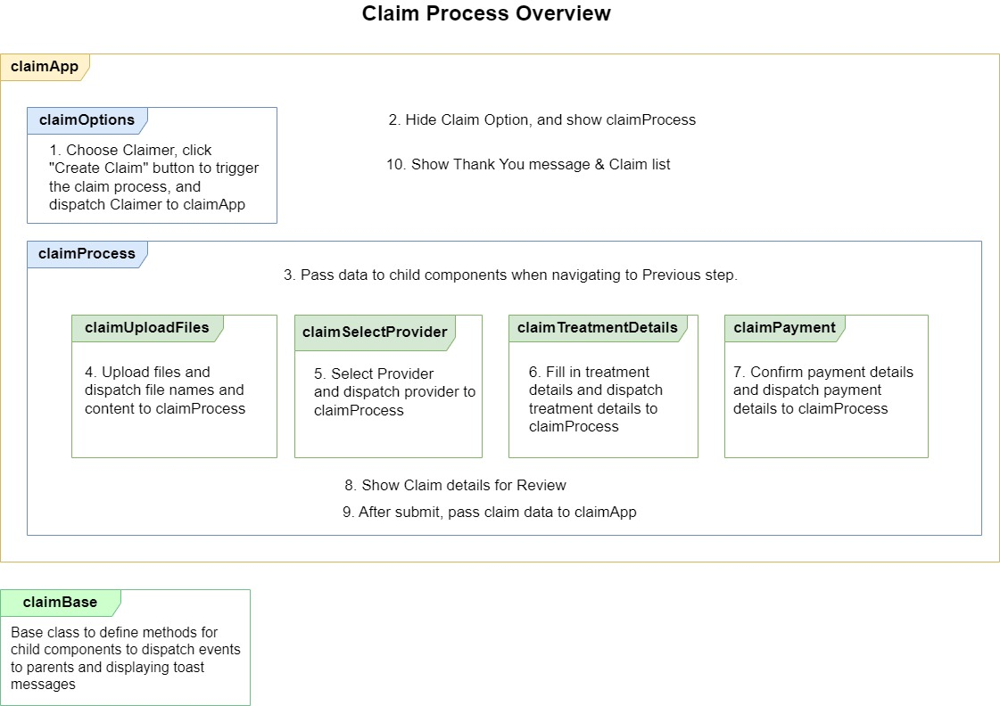

# Claim Management App Overview

The Claim Management App is a demonstration of how Salesforce's Lightning Web Component (LWC) framework can be leveraged to create a user-friendly, efficient, and modular application that supports complex business processes.

The App focuses on the user interface and front-end logic without storing any submitted data.



## App structure

The App consists of several LWCs organized within a Lightning App Page to create a seamless claim processing experience:

-   **claimApp**: Serves as a container for the entire claim management process within the Salesforce UI.
-   **claimOptions**: Allows users to initiate a new claim.
-   **claimProcess**: The main component that houses all the child components necessary for submitting a claim.
-   **claimUploadFiles**: Lets users upload documents related to the claim.
-   **claimSelectProvider**: Enables users to select a service provider for the claim.
-   **claimTreatmentDetails**: Captures claim treatment details.
-   **claimPayment**: For confirming payment details.

## Getting Started

#### Code Checkout and Org Authorization

-   Clone the repository to your local machine.
-   Use Salesforce CLI to authorize your Salesforce org where you intend to deploy the app.

```bash
$ sfdx org:login:web --alias <org-alias> --instance-url <org-url> --set-default
```

#### Deploy Application Components

-   Navigate to the root directory of the project in your terminal.
-   Deploy the components to your Salesforce org

```bash
$ sf project deploy start -x manifest/package.xml
```

#### Assign Permission

-   Grant access to the `Claim App` tab.
